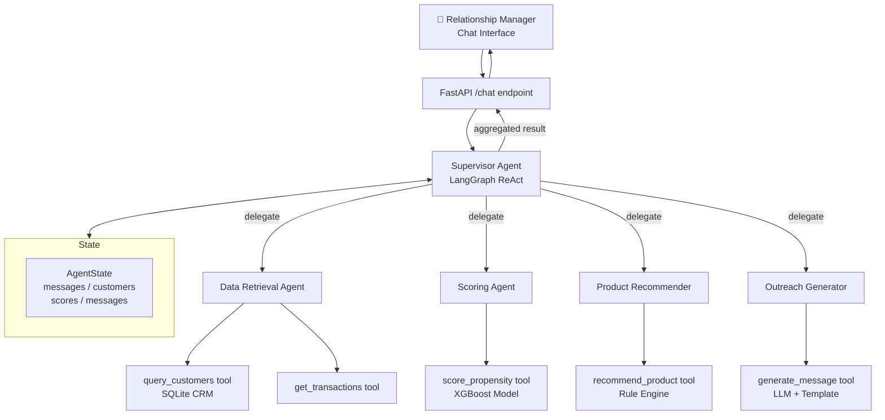

# Agentic AI Banking CRM – Complete Build Guide
### Take-Home Assignment: Conversation-Based Agentic AI for Banking

***

## Executive Summary

This assignment asks you to build a **Supervisor-Subagent multi-agent system** using LangGraph that allows a Relationship Manager (RM) to have a conversation with an AI orchestrator. The agent autonomously decomposes the RM's request, retrieves customer data, scores loan conversion propensity, recommends products, and generates personalized WhatsApp outreach — all through structured tool calls and traceable reasoning.[1][2][3]

The ideal deliverable is a Python monorepo with a FastAPI backend, a LangGraph agent core, a mock SQLite/JSON CRM database, and a simple chat UI (Streamlit or Next.js). Given your background in full-stack AI development, this is very achievable in 3–5 days.

***

## 1. What You're Actually Building

At its core, this is a **multi-agent orchestration system** where:

1. An RM types a natural-language request in a chat interface
2. A **Supervisor Agent** interprets intent and delegates to specialized subagents
3. Each subagent calls a domain-specific tool (DB query, scoring model, message generator)
4. Results flow back through the supervisor, which synthesizes a final structured response
5. Context is preserved across the conversation turn using LangGraph's state management

This is not a chatbot — it's an autonomous, goal-directed workflow engine. The key differentiator evaluated by the panel will be **meaningful tool usage** (not hardcoded outputs) and **clear reasoning flow**.[4][5]

***

## 2. Recommended Architecture

### 2.1 Supervisor-Subagent Pattern

Use the **Supervisor → Subagents as Tools** pattern, which is LangGraph's recommended approach for hierarchical multi-agent systems:[6][7]

```
User (RM Chat)
    │
    ▼
[Supervisor Agent] ← Main orchestrator, holds shared state
    ├──► [Data Retrieval Agent]   → Tool: query_customers(), get_transactions()
    ├──► [Scoring Agent]          → Tool: score_loan_propensity()
    ├──► [Product Recommender]    → Tool: recommend_products()
    └──► [Outreach Generator]     → Tool: generate_whatsapp_message()
```

The supervisor receives the RM's message, reasons about which agent to call next (using ReAct-style chain-of-thought), and passes structured outputs downstream. Each subagent is itself a LangGraph node with its own tools bound to the LLM.[6]

### 2.2 Technology Stack

| Layer | Technology | Reason |
|---|---|---|
| Agent Framework | LangGraph (Python) | Best enterprise-grade agentic framework in 2025[8] |
| LLM | OpenAI GPT-4o or Anthropic Claude 3.5 | Reliable tool calling |
| API Layer | FastAPI | Async, easy streaming support[9] |
| Chat UI | Streamlit (quick) or Next.js | Streamlit for demo speed |
| Database | SQLite + SQLAlchemy | Mock CRM data, zero infrastructure |
| Scoring | scikit-learn (LogisticRegression/XGBoost) | Propensity model[10] |
| State | LangGraph MemorySaver / SQLite checkpointer | Conversation context |
| Config | Pydantic BaseSettings + `.env` | Clean config management |

***

## 3. Repository Structure

This is the exact folder layout to use — clean, modular, and extensible:

```
banking-crm-agent/
├── app/
│   ├── __init__.py
│   ├── main.py                  # FastAPI entrypoint
│   ├── agents/
│   │   ├── supervisor.py        # LangGraph supervisor graph
│   │   ├── data_agent.py        # Customer data retrieval subagent
│   │   ├── scoring_agent.py     # Propensity scoring subagent
│   │   ├── product_agent.py     # Product recommender subagent
│   │   └── outreach_agent.py    # WhatsApp message generator subagent
│   ├── tools/
│   │   ├── crm_tools.py         # DB query tools (@tool decorated)
│   │   ├── scoring_tools.py     # ML scoring tools
│   │   ├── product_tools.py     # Rule-based recommender
│   │   └── message_tools.py     # LLM-based message generation
│   ├── models/
│   │   ├── state.py             # LangGraph AgentState (TypedDict)
│   │   ├── customer.py          # Pydantic customer schema
│   │   └── scoring.py           # Pydantic scoring output schema
│   ├── db/
│   │   ├── database.py          # SQLAlchemy setup
│   │   ├── seed.py              # Mock customer data generator
│   │   └── crm.db               # SQLite file (gitignored)
│   ├── ml/
│   │   ├── train_propensity.py  # Model training script
│   │   └── model.pkl            # Serialized sklearn model
│   └── config.py                # Pydantic Settings
├── frontend/
│   └── app.py                   # Streamlit chat UI
├── tests/
│   ├── test_tools.py
│   └── test_agents.py
├── notebooks/
│   └── propensity_analysis.ipynb
├── .env.example
├── requirements.txt
├── docker-compose.yml
└── README.md
```

This separation — **agents / tools / models / db / ml** — is the standard professional structure for agentic AI systems.[11][12]

***

## 4. Agent Design (Node by Node)

### 4.1 LangGraph State

Define a shared `AgentState` TypedDict that persists throughout the conversation:

```python
from typing import TypedDict, Annotated, List
from langgraph.graph.message import add_messages

class AgentState(TypedDict):
    messages: Annotated[list, add_messages]   # Full conversation history
    rm_intent: str                             # Parsed RM goal
    retrieved_customers: list                  # Raw customer records
    scored_customers: list                     # Customers with propensity scores
    recommended_products: dict                 # Product recommendations per customer
    outreach_messages: list                    # Generated WhatsApp messages
    final_response: str                        # Supervisor's final answer
```

LangGraph's `Annotated[list, add_messages]` pattern automatically appends messages without overwriting. This is how stateful multi-turn conversations are handled.[4]

### 4.2 Supervisor Agent

The supervisor is a `create_react_agent` or a custom `StateGraph` node that:
1. Parses the RM's intent using the LLM
2. Decides which subagent to invoke (using tool calls)
3. Aggregates results into a final structured response

```python
from langgraph.graph import StateGraph, END
from langgraph_supervisor import create_supervisor  # or build manually

supervisor = create_supervisor(
    agents=[data_agent, scoring_agent, product_agent, outreach_agent],
    model=llm,
    prompt="You are a banking CRM assistant. Decompose the RM's request into steps..."
)
```

The `langchain-ai/langgraph-supervisor-py` library provides the exact pattern needed here.[6]

### 4.3 Data Retrieval Agent

This subagent wraps SQL queries as LangChain `@tool` decorated functions:

```python
from langchain_core.tools import tool

@tool
def get_high_value_customers(min_balance: float = 100000, limit: int = 50) -> list:
    """Retrieve customers with account balance above threshold, sorted by value score."""
    # SQLAlchemy query against crm.db
    ...

@tool  
def get_customer_transactions(customer_id: str, months: int = 6) -> list:
    """Get recent transaction history for a specific customer."""
    ...

@tool
def get_customers_without_loans() -> list:
    """Retrieve customers who have no existing personal loan products."""
    ...
```

### 4.4 Scoring Agent (Propensity Model)

This is the most technically impressive part of the system. Build a **loan propensity model** using scikit-learn:[10][13]

**Features to use for scoring:**
- `account_balance` — strong predictor (higher balance = lower risk, more likely to convert)
- `monthly_income` — top predictor per SHAP analysis in real banking models[10]
- `education_level` — encoded ordinal feature
- `credit_score` — standard lending feature  
- `months_since_last_product` — recency of last product purchase
- `avg_monthly_spend` — proxy for financial activity
- `num_existing_products` — cross-sell opportunity signal
- `age_group` — life-stage segmentation[14]
- `has_salary_account` — binary flag for relationship depth

Train on a synthetic dataset with ~9-10% positive conversion rate (realistic for banking). Use `XGBoost` with class weighting or `SMOTE` for imbalance. The scoring tool returns a propensity score (0–1 probability):[10]

```python
@tool
def score_loan_propensity(customer_data: dict) -> dict:
    """Score a customer's likelihood to convert for a personal loan (0-1 probability)."""
    model = joblib.load("app/ml/model.pkl")
    features = extract_features(customer_data)
    score = model.predict_proba([features])[0][1]
    tier = "High" if score > 0.7 else "Medium" if score > 0.4 else "Low"
    return {"customer_id": customer_data["id"], "score": score, "tier": tier}
```

### 4.5 Product Recommender Agent

Uses heuristic rules + LLM reasoning to recommend the right product variant:

```python
@tool
def recommend_product(customer_profile: dict, propensity_score: float) -> dict:
    """Recommend personal loan variant based on customer segment and score."""
    # Rule engine:
    # - High income + high score → Premium Personal Loan (low rate, high limit)
    # - Medium income + medium score → Standard Personal Loan
    # - Salary account holder → Pre-approved Loan offer
    # - Young professional → Flexi Personal Loan
    ...
```

### 4.6 Outreach Generator Agent

This agent uses the LLM with a structured prompt to generate personalized WhatsApp messages. Personalization must include at minimum the customer's name, a contextual hook, and a clear CTA:[15]

```python
@tool
def generate_whatsapp_message(customer: dict, product: dict, score: float) -> str:
    """Generate a personalized WhatsApp message for a specific customer and product."""
    prompt = f"""
    Generate a personalized WhatsApp message for:
    - Customer: {customer['name']}, Age: {customer['age']}, Occupation: {customer['occupation']}
    - Account balance: ₹{customer['balance']:,}, Monthly income: ₹{customer['income']:,}
    - Recommended product: {product['name']} at {product['rate']}% p.a.
    - Propensity score: {score:.0%} likely to convert
    
    Requirements:
    - Under 300 characters, conversational tone
    - Open with personalized hook (name + relevant context)
    - One clear CTA (call/click link)
    - Include opt-out line
    - Language: English (or Hindi if customer's region is North India)
    """
    return llm.invoke(prompt).content
```

***

## 5. Mock CRM Database (Seed Data)

Generate 200–500 synthetic customers with realistic Indian banking profiles:

```python
# db/seed.py — generate with Faker
customers = [
    {
        "id": "CUST001",
        "name": "Rajesh Kumar",
        "age": 34,
        "occupation": "Software Engineer",
        "monthly_income": 85000,
        "account_balance": 2400000,
        "credit_score": 762,
        "num_products": 2,
        "has_personal_loan": False,
        "has_salary_account": True,
        "city": "Bangalore",
        "months_as_customer": 36,
        "avg_monthly_txn": 45000
    },
    ...
]
```

Create 3 tables: `customers`, `transactions`, `products`. This gives your tools something meaningful to query.

***

## 6. API and Chat Interface

### FastAPI Endpoints

```python
# app/main.py
@app.post("/chat")
async def chat(request: ChatRequest):
    """Main conversational endpoint for RM interaction."""
    result = await supervisor_graph.ainvoke({
        "messages": [HumanMessage(content=request.message)],
        "thread_id": request.thread_id  # for conversation persistence
    })
    return {"response": result["final_response"], "customers": result["scored_customers"]}

@app.get("/customers/top")
async def get_top_customers():
    """Returns pre-scored top customers for dashboard view."""
    ...
```

### Streamlit Chat UI

```python
# frontend/app.py
import streamlit as st
import requests

st.title("🏦 Banking CRM AI Assistant")
if prompt := st.chat_input("Ask me to find high-value customers..."):
    response = requests.post("http://localhost:8000/chat", json={"message": prompt})
    st.json(response.json())
```

***

## 7. Three Demo Use Cases

The assignment requires at least 3 use case demonstrations. Here are the recommended scenarios:

| # | RM Query | Agents Triggered | Output |
|---|---|---|---|
| 1 | *"Find high-value customers likely to convert for a personal loan this month"* | Data Agent → Scoring Agent | Top 10 customers with propensity scores, tiers, and reason codes |
| 2 | *"Generate personalized WhatsApp messages for the top 5 customers from the previous list"* | Outreach Agent (uses existing state) | 5 unique, personalized messages with contextual hooks |
| 3 | *"Which customers in Mumbai with salary accounts should we target for pre-approved loans?"* | Data Agent (filtered) → Scoring Agent → Product Agent | Segmented list with pre-approved loan recommendations |

The third use case demonstrates the system's **context retention** (it remembers previous conversation turns) and **filter-aware querying** — two key evaluation criteria.[2][4]

***

## 8. Key Design Decisions to Discuss in README

### Decision 1: Supervisor Pattern vs. Full Graph
**Chose:** Supervisor-as-orchestrator pattern  
**Trade-off:** Simpler to extend (add new subagents without changing graph edges), but introduces a single point of failure. Alternative: Parallel node graph for performance-critical production.[7]

### Decision 2: Rules + ML Hybrid Scoring
**Chose:** XGBoost propensity model + rule-based tier assignment  
**Trade-off:** More interpretable than pure ML (critical for banking compliance), but requires retraining as customer behavior shifts. Pure LLM scoring would be simpler but non-deterministic and costly.[13][10]

### Decision 3: SQLite for Mock CRM
**Chose:** SQLite + SQLAlchemy  
**Trade-off:** Zero-infrastructure demo setup. In production, this would be PostgreSQL or a dedicated CRM like Salesforce with its API. The tool interface abstracts the DB layer, making the swap seamless.[3]

### Decision 4: Stateful Conversation with LangGraph Checkpointer
**Chose:** `MemorySaver` checkpointer with `thread_id` keying  
**Trade-off:** In-memory only (lost on restart). Production would use `SqliteSaver` or `PostgresSaver`. This allows the RM to say "generate messages for those customers" in a follow-up turn without re-specifying which customers.[4]

***

## 9. Architecture Diagram (for README)

Include this Mermaid diagram in your README:



***

## 10. Execution Flow (for README)

```
1. RM sends message: "Find high-value customers for personal loan"
   │
2. FastAPI receives request, creates thread_id, invokes Supervisor graph
   │
3. Supervisor LLM reasons: needs customer data + scoring → calls Data Agent
   │
4. Data Agent tool: query_customers(min_balance=500000, no_loan=True) → returns 50 records
   │
5. Supervisor routes to Scoring Agent with retrieved customers
   │
6. Scoring Agent: score_loan_propensity() for each → returns {id, score, tier}
   │
7. Supervisor filters top 10 (score > 0.65), routes to Product Agent
   │
8. Product Agent: recommend_product() per segment → returns product variant
   │
9. Supervisor synthesizes final response with table of top customers
   │
10. FastAPI streams response back to RM chat UI
    │
    [RM follows up: "Generate WhatsApp messages for them"]
    │
11. Supervisor uses AgentState (customers already in state) → routes to Outreach Agent
    │
12. Outreach Agent: generate_whatsapp_message() × 10 → returns personalized messages
    │
13. Final response delivered with copy-ready messages
```

***

## 11. Limitations to Acknowledge

Evaluators expect honest trade-off analysis:[1][3]

- **Synthetic data:** The mock CRM does not represent real customer distributions. Production systems require privacy-compliant PII handling and data governance.
- **No real WhatsApp API:** Messages are generated but not sent. Integration with WhatsApp Business API (Meta) would require approved templates and business verification.[15]
- **Model drift:** The propensity model is trained on static synthetic data. Real-world systems need continuous retraining pipelines as customer behavior evolves.[14]
- **Latency:** Sequential agent calls (data → score → recommend → message) create cumulative latency (~15–30s for 10 customers). Production would parallelize with `asyncio.gather` or LangGraph's parallel nodes.
- **No RAG layer:** A production system would add a vector store (Pinecone/pgvector) over product documentation so the recommender retrieves factual product details rather than hallucinating rates and terms.[4]
- **LLM non-determinism:** Message generation varies per run. Production needs evaluation metrics and output validation.

***

## 12. Setup Instructions Template

```bash
# Clone and install
git clone https://github.com/yourusername/banking-crm-agent
cd banking-crm-agent
python -m venv venv && source venv/bin/activate
pip install -r requirements.txt

# Configure environment
cp .env.example .env
# Add: OPENAI_API_KEY=sk-... or ANTHROPIC_API_KEY=sk-...

# Seed mock database
python app/db/seed.py

# Train propensity model
python app/ml/train_propensity.py

# Start backend
uvicorn app.main:app --reload --port 8000

# Start frontend (new terminal)
streamlit run frontend/app.py
```

***

## 13. Evaluation Alignment

| Criterion | How This Architecture Addresses It |
|---|---|
| **System Design** | Modular supervisor-subagent graph; each component independently testable and replaceable[6] |
| **Agentic Thinking** | LLM-driven task decomposition; supervisor reasons about which tool to call and why[4] |
| **Tool Usage** | 6 distinct `@tool` functions with typed inputs/outputs, each calling real DB/model/LLM[16] |
| **Output Quality** | Personalized messages use customer name + income + occupation + product as context[15][17] |
| **Clarity** | README with Mermaid architecture, execution flow, trade-offs, and setup instructions |

***

## 14. What Will Disqualify You (Per Assignment Rules)

- Returning hardcoded customer lists without querying the DB — add real SQLAlchemy queries
- Calling the LLM with a prompt like "return 5 customers" without a tool — every action must go through a `@tool`
- Not maintaining conversation state (each message treated as fresh context)
- Missing README sections (architecture, trade-offs, setup)
- No demo video showing at least 3 use cases