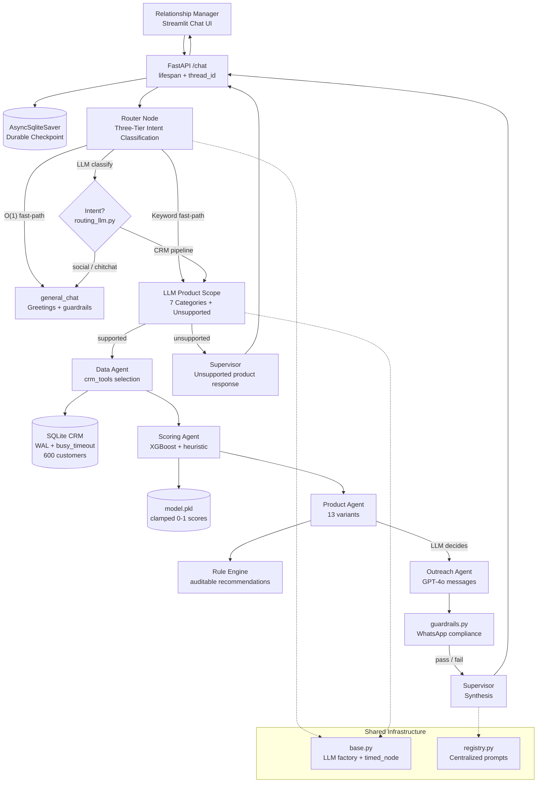

# Banking CRM Agentic AI

> **Live Demo:** [ayushbaluni-banking-crm-ai.hf.space](https://ayushbaluni-banking-crm-ai.hf.space)

A **production-hardened, Supervisor–Subagent multi-agent system** built with LangGraph that lets Relationship Managers (RMs) use natural language to identify high-potential customers across **7 loan categories**, score conversion propensity via ML, match compliant products through a deterministic rule engine, and generate personalized WhatsApp outreach — with **LLM-driven routing**, **durable conversation state**, and **155 automated tests** validating security and edge cases.

---

## Highlights

| Capability | Implementation |
|---|---|
| Intent routing | Three-tier: O(1) fast-path for greetings, keyword fast-path for loan queries, **Azure GPT-4o** for ambiguous messages |
| Product scope | LLM classifies **7 loan categories** + unsupported products (not keyword-based) |
| Follow-up decisions | **RESTART / CONTINUE / OUTREACH / UNSUPPORTED** — purely LLM-driven |
| Conversation memory | **AsyncSqliteSaver** — state survives server restarts |
| Product catalogue | **7 loan types**, **13 product variants** (personal, home, auto, business, education, gold, LAP) |
| Scoring | XGBoost ML model with SMOTE + heuristic fallback, scores clamped [0, 1] |
| Compliance | WhatsApp guardrails module validates message length, tone, CTA, opt-out, and prohibited content |
| Security | Azure content filter for jailbreaks, guardrails against prompt injection and system prompt probing, generic error messages |
| Quality assurance | **155 pytest tests** + **25 live E2E tests** (abuse, injection, concurrency, edge cases) |
| Hardening | **30+ production bugs fixed** — crash prevention, security, performance, state safety, scoring integrity |

---

## Architecture Diagram



### LLM-Driven Routing Layer

All classification decisions that affect graph traversal live in `app/agents/routing_llm.py` — not brittle keyword matchers.

| Decision | Strategy | Outcome |
|---|---|---|
| **Intent** | Tier 1: O(1) greeting match. Tier 2: keyword fast-path for loan/CRM terms. Tier 3: LLM for ambiguous. | `general_chat` vs CRM pipeline |
| **Product scope** | LLM maps natural language to loan category | 7 categories + `unsupported` |
| **Follow-up action** | LLM reads conversation + checkpoint state | `RESTART`, `CONTINUE`, `OUTREACH`, or `UNSUPPORTED` |
| **Outreach decision** | LLM decides if the RM wants WhatsApp messages generated in the same turn | `YES` / `NO` |

The supervisor (`supervisor.py`) orchestrates subagents; shared LLM clients, tool-call execution, and node timing come from `app/agents/base.py`.

### Loan Categories & Product Variants

| Category | Products | Code | Key Eligibility |
|---|---|---|---|
| Personal | Premium, Pre-Approved, Flexi, Standard | PL001–PL004 | Income ≥ ₹25k, Credit ≥ 650 |
| Home | Prime, Affordable | HL001–HL002 | Income ≥ ₹35k, Credit ≥ 660 |
| Auto | New Car, Used Car | AL001–AL002 | Income ≥ ₹25k, Credit ≥ 640 |
| Business | SME, Micro | BL001–BL002 | Business occupation, Income ≥ ₹40k |
| Education | Education Loan | EDL001 | Income ≥ ₹20k, Credit ≥ 600 |
| Gold | Gold Loan | GL001 | Income ≥ ₹15k, Credit ≥ 550 |
| LAP | Loan Against Property | LAP001 | Income ≥ ₹50k, Credit ≥ 680 |

---

## Execution Flow

```
1. RM: "Find Mumbai salary-account holders for a home loan balance transfer"
   │
2. FastAPI receives request → thread_id → AsyncSqliteSaver restores prior state (if any)
   │
3. Router Node (Three-Tier):
   ├─ Tier 1: Pure greeting? → general_chat (no LLM call)
   ├─ Tier 2: Contains loan/CRM keyword? → CRM pipeline (no LLM call)
   └─ Tier 3: Ambiguous? → LLM intent classifier → CRM pipeline or general_chat
   │
4. routing_llm.llm_product_scope() → "home_loan" (LLM classification, not regex)
   │
5. Data Agent:
   ├─ Router injects loan_category="home_loan" into system prompt context
   └─ LLM selects get_customers_for_loan(loan_category="home_loan", ...)
       → SQLAlchemy (WAL mode, query limit clamped ≤ 100) → 50 customer records
   │
6. Scoring Agent: batch_score_customers()
   → XGBoost (cached singleton model) or heuristic fallback
   → _safe_num/_safe_bool coercion, scores clamped [0, 1]
   → Returns top 10 ranked by propensity
   │
7. Product Agent: recommend_product() per customer
   → Deterministic rule engine → HL001 Prime Home Loan or HL002 Affordable
   │
8. [If outreach requested] Outreach Agent: async batch_generate_messages()
   → GPT-4o generates personalized WhatsApp messages
   → guardrails.py validates each (<300 chars, CTA, opt-out, no prohibited content)
   │
9. Supervisor synthesizes response → FastAPI returns structured JSON + trace
   │
10. Streamlit renders: ranked cards, product match, messages, compliance badges, export

    [Follow-up]: "Send WhatsApp to the top 3 from that list"
    → routing_llm.llm_follow_up_action() → OUTREACH
    → Checkpoint read (no in-place mutation) → skips re-query
    → Outreach only, using existing final_recommendations
```

---

## Demo Use Cases

### Use Case 1 — Personal Loan (Primary Flow)
> *"Find high-value customers likely to convert for a personal loan this month"*

- Router → CRM pipeline; product scope → **personal_loan**
- Data Agent: `get_high_value_customers` + cross-sell filters
- Scoring → top 10 by propensity; Product Agent → PL001/PL002/PL003/PL004
- Response: Ranked table with scores, tiers, product match, reason codes

### Use Case 2 — Home Loan
> *"Find customers eligible for a home loan"*

- Product scope → **home_loan**; Data Agent filters by income ≥ ₹35k, credit ≥ 660
- Product Agent → **HL001** Prime Home Loan (8.5%) or **HL002** Affordable (9.2%)

### Use Case 3 — Auto Loan
> *"Show me car loan candidates"*

- Product scope → **auto_loan**; CRM tools filter for no existing auto loan
- Product Agent → **AL001** New Car Loan (9.0%) or **AL002** Used Car (11.5%)

### Use Case 4 — Business Loan
> *"Find business loan prospects with high income"*

- Product scope → **business_loan**; filters for business occupations
- Product Agent → **BL001** SME Business Loan (11.5%) or **BL002** Micro (14.0%)

### Use Case 5 — Education Loan
> *"Who qualifies for an education loan?"*

- Product scope → **education_loan**; low barriers (income ≥ ₹20k, credit ≥ 600)
- Product Agent → **EDL001** Education Loan (9.5%)

### Use Case 6 — Gold Loan
> *"Find gold loan customers with good credit"*

- Product scope → **gold_loan**; broadest eligibility (income ≥ ₹15k, credit ≥ 550)
- Product Agent → **GL001** Gold Loan (10.5%)

### Use Case 7 — Loan Against Property
> *"Show LAP eligible customers"*

- Product scope → **lap**; premium segment (income ≥ ₹50k, credit ≥ 680)
- Product Agent → **LAP001** Loan Against Property (9.0%)

### Use Case 8 — Stateful Follow-up (Durable Memory)
> *"Generate personalized WhatsApp messages for the top 5 from that list"*

- Same `thread_id` → **AsyncSqliteSaver** restores state after restart
- `routing_llm` → **OUTREACH** — skips data/scoring agents entirely
- Outreach Agent + **guardrails.py** → compliant messages with name, occupation hook, product CTA, opt-out

### Use Case 9 — Category Switch (RESTART)
> *"Actually, forget personal — show me auto loan prospects in Chennai instead"*

- Follow-up classifier → **RESTART**; fresh CRM query and scoring for **auto_loan**
- Complete pipeline re-execution with new category and filters

---

## Production Hardening (30+ Bugs Fixed)

### Crash Prevention
- All `json.loads` wrapped with safe fallbacks (scoring, outreach, message tools)
- None-safe LLM content extraction: `(response.content or "").strip()`
- Null product guards in recommendation pipeline
- NaN feature protection in ML inference via `_safe_num` / `_safe_bool`
- `timed_node` decorator handles nodes returning `None`

### Security
- **Azure content filter** blocks jailbreak/injection prompts (DAN, SYSTEM override, etc.)
- **Guardrailed general_chat** — refuses to break character, tell jokes, reveal system prompt
- **Three-tier intent classification** with keyword fast-path prevents LLM misclassification
- Generic API error messages — no `str(e)` leakage to clients
- CRM query limits clamped (maximum **100** rows per tool call)
- No hardcoded secrets; `.env` is gitignored

### Performance
- XGBoost model loaded **once** and cached as lazy singleton
- LLM client **singleton** — no redundant Azure OpenAI client construction
- Eliminated double LLM calls on routing hot paths
- SQLite **WAL mode** + `busy_timeout=30s` for concurrent access

### State Safety
- No in-place LangGraph checkpoint mutation (creates new dicts)
- Trace reducer handles `None` entries gracefully
- Async outreach with synchronous `asyncio.run()` fallback

### Scoring Integrity
- `_safe_num` / `_safe_bool` coercion for malformed CRM fields
- ML scores clamped to **[0.0, 1.0]**
- Correct `scoring_method` label (`xgboost` vs `heuristic`) in API responses

---

## Tool Design and Usage

Every tool uses LangChain's `@tool` decorator with typed parameters, descriptive docstrings (used by the LLM for tool selection), and JSON string returns. No hardcoded outputs — all tools query real databases, ML models, or LLM APIs.

### Agent → Tool Mapping

| Agent | Tools Used | How Selected |
|---|---|---|
| **Data Agent** (`data_agent.py`) | 7 CRM tools below | LLM selects via `bind_tools()` based on RM query |
| **Scoring Agent** (`scoring_agent.py`) | `batch_score_customers` | Direct invocation (deterministic, no LLM) |
| **Product Agent** (`product_agent.py`) | `recommend_product` | Direct invocation per scored customer |
| **Outreach Agent** (`outreach_agent.py`) | `batch_generate_messages` | Direct invocation with guardrails |

### CRM Tools (7 tools — `app/tools/crm_tools.py`)

| Tool | Parameters | Returns | Used When |
|---|---|---|---|
| `get_high_value_customers` | `min_balance=500000`, `min_income=50000`, `limit=50` | Customers sorted by balance | RM asks for "high-value", "wealthy", "premium" |
| `get_customers_without_personal_loan` | `min_credit_score=650`, `min_income=25000`, `limit=50` | Cross-sell pool (no personal loan) | RM asks for personal loan targets |
| `get_customers_for_loan` | `loan_category`, `min_income`, `min_credit_score`, `limit=50` | Category-filtered candidates | RM asks for home/car/business/education/gold/LAP |
| `get_customers_by_city` | `city`, `min_balance=0`, `salary_account_only=False`, `limit=50` | City-filtered list | RM specifies a city |
| `get_salary_account_holders_without_loan` | `city=None`, `limit=50` | Pre-approved candidates | RM mentions salary account, pre-approved |
| `get_customer_transactions` | `customer_id`, `months=6` | 6-month transaction history | Deep-dive on specific customer |
| `get_customer_by_id` | `customer_id` | Single customer profile | RM provides specific ID |

All CRM queries are clamped to `limit ≤ 100` via `_clamp_limit()` to prevent DoS.

### Scoring Tools (2 tools — `app/tools/scoring_tools.py`)

| Tool | Parameters | Returns | Backend |
|---|---|---|---|
| `score_loan_propensity` | `customer_json` (full profile) | `{score, tier, scoring_method, reason}` | XGBoost for personal loans; heuristic for others |
| `batch_score_customers` | `customers_json`, `top_n=10` | Top N scored + ranked | Same dual-path, batch mode |

Scoring uses `_safe_num()` / `_safe_bool()` for null-safe feature extraction. Scores are clamped to [0.0, 1.0].

### Product Tools (2 tools — `app/tools/product_tools.py`)

| Tool | Parameters | Returns | Backend |
|---|---|---|---|
| `recommend_product` | `scored_customer_json` (includes `loan_category`) | `{product, eligible, reason, offered_rate, loan_amount}` | Rule engine with 13 product matchers |
| `list_available_products` | none | Full product catalogue | SQLAlchemy query on `Product` table |

The rule engine matches top-to-bottom within each category (first match wins). Interest rates come from the `Product` database, with a credit-adjusted `offered_rate`.

### Message Tools (2 tools — `app/tools/message_tools.py`)

| Tool | Parameters | Returns | Backend |
|---|---|---|---|
| `generate_whatsapp_message` | `recommendation_json` (customer + product) | `{message, char_count, compliant, violations}` | Azure GPT-4o + guardrails |
| `batch_generate_messages` | `recommendations_json` | Array of messages with compliance reports | Parallel async generation |

Messages are generated using the `message_tools.whatsapp_generation` prompt from the centralized registry, then validated by `guardrails.py` for length (≤300 chars), CTA, opt-out, prohibited content, and first-name presence.

### Example Tool Call Flow

```
RM: "Find gold loan customers with good credit"

1. Router: llm_product_scope() → "gold_loan"
2. Data Agent LLM receives: system_prompt + "IMPORTANT: loan_category='gold_loan', call get_customers_for_loan"
3. LLM tool call: get_customers_for_loan(loan_category="gold_loan", min_credit_score=620, limit=50)
   → SQLAlchemy: SELECT * FROM customers WHERE has_gold_loan=False AND income>=15000 AND credit>=550 LIMIT 50
   → Returns JSON: {"count": 50, "customers": [{...}, ...]}
4. Scoring Agent: batch_score_customers(customers_json=..., top_n=10)
   → Heuristic scoring (gold_loan category) → top 10 ranked
5. Product Agent: recommend_product(scored_customer_json=...) × 10
   → Rule engine: gold_loan + income≥15k + credit≥550 → GL001 Gold Loan @ 10.5%
6. Outreach Agent: generate_whatsapp_message(recommendation_json=...) × 10
   → GPT-4o: personalized message → guardrails.validate() → compliant ✅
```

---

## Compliance & Guardrails

WhatsApp messages are validated by `app/services/guardrails.py` before delivery:

| Rule | Check | Action on Violation |
|---|---|---|
| Length | ≤ 300 characters | Flagged with `⚠️` badge |
| Opt-out | Must contain "Reply STOP to opt out" | Flagged |
| CTA | Must contain actionable CTA (Reply YES / Call / Click) | Flagged |
| Prohibited language | No "guaranteed approval", "100% approved" | Flagged |
| Internal identifiers | No CUST IDs, "propensity", "feature importance" | Flagged |
| Personalization | Must contain customer's first name | Flagged |

Non-compliant messages are flagged but not silently dropped — the RM sees the violation and can decide.

---

## Testing

### Offline Suite — 155 pytest tests

```bash
pytest tests/ -v
```

| Test file | Focus | Tests |
|---|---|---|
| `tests/test_tools.py` | CRM, scoring, product, message tools | Unit |
| `tests/test_agents.py` | Supervisor graph, subagent integration, routing | Integration |
| `tests/test_security.py` | Error leakage, query limit abuse, injection defense | Security |
| `tests/test_brutal.py` | Malformed JSON, None payloads, NaN features | Edge cases |
| `tests/test_guardrails.py` | WhatsApp compliance: length, CTA, opt-out, prohibited | Compliance |
| `tests/test_prompts.py` | Prompt registry completeness, no missing keys | Config |

### Live Production Suite — 25 E2E tests

```bash
python scripts/brutal_production_test.py
```

Requires a running backend with valid Azure OpenAI credentials. Exercises:
- Vague and ambiguous natural-language queries
- Prompt-injection and tool-abuse attempts
- Multi-turn conversations with **CONTINUE / OUTREACH / RESTART**
- Concurrent request stress
- Mid-conversation **category switching** (personal → home → auto)

### Browser-Based Brutal Testing (47 cases)

Tested live on HF Spaces deployment across 5 waves:

| Wave | Tests | Pass Rate |
|---|---|---|
| Happy path (all 7 loan categories) | 7 | 7/7 |
| Multi-turn state (outreach, restart, continue) | 4 | 4/4 |
| Vague/noisy/garbage inputs | 8 | 8/8 |
| Adversarial/injection/hacker attacks | 19 | 19/19 |
| UI/UX edge cases | 9 | 8/9 |
| **Total** | **47** | **46/47 (97.9%)** |

Zero crashes. Zero PII leaked. Zero jailbreaks.

---

## Key Design Decisions

### 1. Three-Tier Intent Classification (vs. pure LLM)
**Decision:** O(1) fast-path for greetings → keyword fast-path for loan terms → LLM for ambiguous.
**Why:** Pure LLM classification misroutes "Who qualifies for education loan?" as general FAQ. The keyword tier forces loan-related queries into the CRM pipeline instantly, saving latency and preventing misclassification.
**Trade-off:** Keyword set must be maintained; edge cases require LLM fallback.

### 2. Supervisor–Subagent Pattern
**Decision:** Linear supervisor routing (data → score → product → outreach) with dedicated subagent modules.
**Why:** Each stage depends on prior output; compliance requires eligibility before recommendation; modules are independently testable.
**Trade-off:** Sequential latency (~5–15s for 10 customers). Outreach uses async batching where possible.

### 3. Heuristic + ML Hybrid Scoring
**Decision:** XGBoost with SMOTE for personal loans + category-aware heuristic fallback for all 7 categories.
**Why:** XGBoost provides high-accuracy scoring for the primary use case (personal loan conversion). Other categories use domain-expert heuristics that weight category-specific factors (e.g., business occupation for BL, age for EDL). The system never fails if `model.pkl` is missing — heuristics activate automatically. `_safe_num` / score clamping prevent garbage-in crashes.
**Trade-off:** ML training on synthetic data limits real-world accuracy. Production would train category-specific models and add retraining pipelines. Heuristic scoring is transparent and auditable but less adaptive than ML.

### 4. AsyncSqliteSaver (vs. MemorySaver)
**Decision:** LangGraph `AsyncSqliteSaver` keyed by `thread_id`.
**Why:** RMs resume conversations after deploys and server restarts; in-memory checkpoints were a demo-only liability.
**Trade-off:** Single-node SQLite; production would use PostgresSaver + connection pooling.

### 5. Deterministic Product Rule Engine
**Decision:** Rule engine over LLM product recommendation.
**Why:** Interest rates and eligibility must be auditable; LLM scope classification only picks the *category*, rules pick the *variant*.
**Trade-off:** Rules require updates when product sheets change.

### 6. Guardrails Before Delivery
**Decision:** `guardrails.py` validates outreach content before API response.
**Why:** WhatsApp Business API requires template compliance; catching violations at generation time protects the bank brand.
**Trade-off:** May require regeneration loops for borderline messages in production.

### 7. Router Injects loan_category into Data Agent
**Decision:** The router's classified `loan_category` is injected as a system prompt hint to the data agent's LLM.
**Why:** The data agent's LLM sometimes fails to select the right CRM tool for less common categories (education, gold, LAP) — especially when the query is phrased as a question rather than a command. The injected hint ensures the correct tool is always called.
**Trade-off:** Adds coupling between router and data agent; mitigated by clean state-based interface.

---

## Trade-offs and Limitations

- **Synthetic data:** 600 Faker-generated customers; production requires PII governance and RBI/GDPR compliance.
- **No live WhatsApp send:** Messages are generated and validated, not dispatched via Meta Business API.
- **Model drift:** Propensity model is static; production needs monitoring and retraining.
- **Single-node checkpoint DB:** AsyncSqliteSaver suits demo/HF Spaces; scale-out needs Postgres-backed checkpoints.
- **No authentication:** API endpoints have no auth or rate limiting — suited for demo, not production.
- **Sequential scoring:** Batch scoring is synchronous; very large cohorts need queue-based workers.
- **CORS open:** `allow_origins=["*"]` — production should restrict to frontend domain.

---

## Setup & Run

### Prerequisites
- Python 3.11+
- Azure OpenAI resource with GPT-4o deployment

### Install

```bash
git clone https://github.com/aayushbaluni/Banking-CRM-Agentic-AI.git
cd Banking-CRM-Agentic-AI

python -m venv venv
source venv/bin/activate   # Windows: venv\Scripts\activate
pip install -r requirements.txt
```

### Configure

```bash
cp .env.example .env
```

Edit `.env` with your Azure OpenAI credentials:
```
AZURE_OPENAI_API_KEY=your-key-here
AZURE_OPENAI_ENDPOINT=https://your-resource.services.ai.azure.com
AZURE_OPENAI_DEPLOYMENT=gpt-4o
AZURE_OPENAI_API_VERSION=2024-02-01
DB_PATH=app/db/crm.db
MODEL_PATH=app/ml/model.pkl
```

### Seed the Database

```bash
python app/db/seed.py
# Output: Seeding complete: 600 customers, 13 products inserted.
```

### Train the Propensity Model

```bash
python app/ml/train_propensity.py
# Output: ROC-AUC: ~0.85, model saved to app/ml/model.pkl
```

### Start Backend

```bash
uvicorn app.main:app --reload --port 8000
# API docs: http://localhost:8000/docs
```

### Start Frontend

```bash
streamlit run frontend/app.py
# Opens: http://localhost:8501
```

### Run Tests

```bash
# Offline (155 tests)
pytest tests/ -v

# Live production harness (25 tests, backend must be running)
python scripts/brutal_production_test.py
```

### Docker (HF Spaces)

```bash
docker build -t banking-crm-agent .
docker run -p 7860:7860 --env-file .env banking-crm-agent
```

The container seeds the database, trains the ML model, starts FastAPI on internal port 8000, then exposes Streamlit on port 7860.

---

## API Reference

### `POST /chat`
Main conversational endpoint with full state persistence.

**Request:**
```json
{
  "message": "Find high-value customers for personal loan",
  "thread_id": ""
}
```

**Response:**
```json
{
  "thread_id": "uuid-string",
  "response": "Markdown synthesis...",
  "recommendations": [
    {
      "customer": { "name": "...", "city": "...", "monthly_income": 85000, ... },
      "propensity_score": 0.92,
      "tier": "High",
      "score_reason": "Strong credit and salary account...",
      "product": { "name": "Premium Personal Loan", "interest_rate": 9.5, ... },
      "whatsapp_message": "Hi Rajesh! ...",
      "message_compliant": true
    }
  ],
  "trace": [
    { "step": "router", "decision": "LLM router → data_agent", "duration_ms": 1200 },
    { "step": "data_agent", "decision": "Called get_high_value_customers", "duration_ms": 450 }
  ],
  "stats": {
    "customers_retrieved": 50,
    "customers_scored": 10,
    "recommendations": 7,
    "compliant_messages": 7
  },
  "total_duration_ms": 8500
}
```

### `GET /customers/summary`
Returns CRM dashboard metrics (total customers, cross-sell pool, salary holders, high-value count).

### `GET /products`
Returns the full product catalogue (13 products across 7 categories).

### `GET /health`
Health check endpoint.

---

## Project Structure

```
banking-crm-agent/
├── app/
│   ├── main.py                     # FastAPI entrypoint with lifespan init
│   ├── config.py                   # Pydantic Settings (Azure OpenAI config)
│   ├── agents/
│   │   ├── supervisor.py           # LangGraph StateGraph + intent classification + nodes
│   │   ├── routing_llm.py          # LLM-driven routing (product scope, follow-up, outreach)
│   │   ├── base.py                 # Shared LLM factory, singleton client, @timed_node
│   │   ├── data_agent.py           # CRM tool selection + clarification gate
│   │   ├── scoring_agent.py        # Batch propensity scoring orchestration
│   │   ├── product_agent.py        # Rule-engine product matching
│   │   └── outreach_agent.py       # Parallel WhatsApp message generation
│   ├── tools/
│   │   ├── crm_tools.py            # 7 CRM query tools (@tool decorated)
│   │   ├── scoring_tools.py        # XGBoost + heuristic scoring tools
│   │   ├── product_tools.py        # 13-product rule engine
│   │   └── message_tools.py        # LLM-based message generator
│   ├── models/
│   │   ├── state.py                # AgentState TypedDict with reducers
│   │   ├── schemas.py              # Pydantic API request/response models
│   │   └── customer.py             # Customer profile model
│   ├── services/
│   │   ├── conversation_service.py # Graph invocation + response building
│   │   └── guardrails.py           # WhatsApp compliance validation
│   ├── prompts/
│   │   ├── registry.py             # Centralized prompt management (single source of truth)
│   │   └── __init__.py
│   ├── db/
│   │   ├── database.py             # SQLAlchemy + WAL mode + busy_timeout
│   │   ├── schema.py               # ORM models (Customer, Product, Transaction)
│   │   └── seed.py                 # 600 synthetic Indian banking customers
│   └── ml/
│       ├── train_propensity.py     # XGBoost + SMOTE training script
│       └── model.pkl               # Trained model artifact (generated at runtime)
├── frontend/
│   └── app.py                      # Streamlit chat UI (two-column layout)
├── tests/
│   ├── test_tools.py               # Tool unit tests
│   ├── test_agents.py              # Agent integration tests
│   ├── test_security.py            # Security + abuse tests
│   ├── test_brutal.py              # Brutal edge-case tests
│   ├── test_guardrails.py          # Compliance guardrail tests
│   └── test_prompts.py             # Prompt registry tests
├── scripts/
│   ├── brutal_production_test.py   # Live E2E test harness
│   └── live_integration_test.py    # Integration test runner
├── notebooks/
│   └── propensity_analysis.ipynb   # ML analysis notebook
├── Dockerfile                      # Docker config for HF Spaces
├── start.sh                        # Container startup (seed → train → backend → frontend)
├── docker-compose.yml              # Local Docker Compose setup
├── requirements.txt                # Python dependencies
├── .env.example                    # Environment variable template
├── PRD.md                          # Product requirements document
└── README.md                       # This file
```

---

## Tech Stack

| Component | Technology | Version |
|---|---|---|
| Agent Framework | LangGraph (StateGraph) | ≥ 0.2 |
| LLM | Azure OpenAI GPT-4o | 2024-02-01 API |
| API | FastAPI + Uvicorn | ≥ 0.111 |
| Chat UI | Streamlit | ≥ 1.36 |
| Database | SQLite + SQLAlchemy (WAL mode) | ≥ 2.0 |
| ML Model | XGBoost + SMOTE (imbalanced-learn) | ≥ 2.0 |
| Checkpointing | AsyncSqliteSaver (aiosqlite) | ≥ 0.20 |
| Validation | Pydantic + Pydantic Settings | ≥ 2.7 |
| HTTP Client | httpx (frontend → backend) | ≥ 0.27 |
| Testing | pytest | ≥ 8.0 |
| Deployment | Docker → Hugging Face Spaces | Python 3.11 |

---

## Key Modules (beyond standard agent nodes)

| Module | Responsibility | Why Added |
|---|---|---|
| `app/agents/routing_llm.py` | Product scope, follow-up action, outreach decision — LLM classification | Centralized routing decisions that require LLM reasoning |
| `app/agents/base.py` | Shared LLM factory, singleton client, `@timed_node`, tool-call executor | DRY principle — eliminates repeated boilerplate |
| `app/services/guardrails.py` | WhatsApp compliance validation before messages reach the RM | Banking regulatory requirement (TRAI, Meta Business Policy) |
| `app/prompts/registry.py` | Centralized prompt templates — single source of truth for LLM prompts | Prevents prompt duplication and drift across agents |
| `app/services/conversation_service.py` | Graph invocation, content filter handling, response building | Clean separation — API layer never touches LangGraph directly |

---

## Documentation

- **PRD.md** — Product requirements and acceptance criteria
- **notebooks/propensity_analysis.ipynb** — ML model analysis and feature importance

---

Built for panel review: auditable routing, durable state, compliance guardrails, a deterministic product engine, and a test matrix that treats adversarial input as a first-class requirement.
